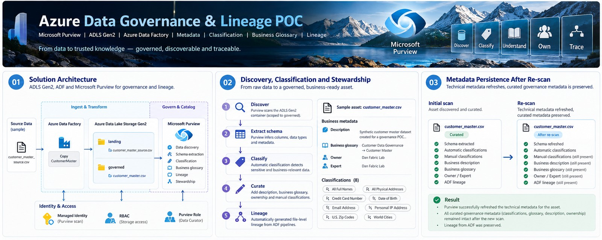
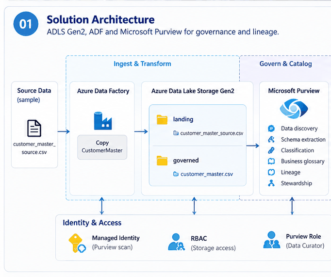
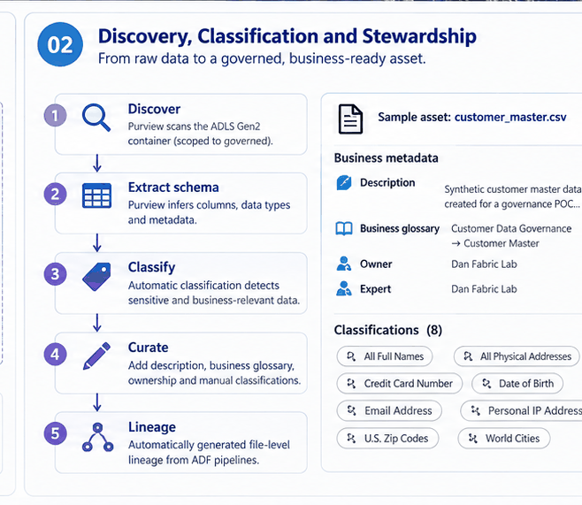
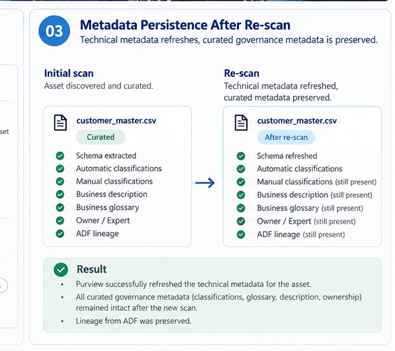

<p align="center">
  
</p>

<h1 align="center">Azure Data Governance & Lineage POC</h1>

<p align="center">
  Making data discoverable, understandable, owned, classified, and traceable.
</p>

<p align="center">
  <a href="docs/architecture.md">Architecture</a> |
  <a href="docs/README.md">Documentation</a> |
  <a href="docs/evidence/README.md">Evidence</a> |
  <a href="docs/governance-model.md">Governance Model</a> |
  <a href="docs/validation-summary.md">Validation</a>
</p>

---

## The problem

A technically valid dataset is not fully trustworthy if consumers cannot answer:

- What is this asset?
- Where did it come from?
- Who owns it?
- Which fields may contain sensitive information?
- Which business concept does it represent?
- What process produced it?

The challenge is not simply to store or move data.

The challenge is to make **data discoverable, understandable, owned, classified, and traceable**.

---

## The idea

This project uses a deliberately small Azure data estate to demonstrate practical governance mechanics with:

- Microsoft Purview
- Azure Data Lake Storage Gen2
- Azure Data Factory
- Managed Identity
- Azure RBAC
- metadata discovery
- classification
- stewardship
- business glossary
- automated lineage

The scope is intentionally compact. The goal is not to simulate an enterprise-wide governance program; it is to prove the reasoning and implementation patterns behind a defensible governance MVP.

### Project overview

<p align="center">
  
</p>

The overview summarizes the relationship between the governed data estate, Microsoft Purview, Azure Data Factory, stewardship, classification, and lineage. The sections below break those capabilities down into their engineering details.

---

## At a glance

| Area | Implementation |
|---|---|
| Cloud platform | Microsoft Azure |
| Governance / catalog | Microsoft Purview |
| Storage | Azure Data Lake Storage Gen2 |
| Orchestration | Azure Data Factory |
| Identity | System-assigned Managed Identity |
| Authorization | Azure RBAC |
| Discovery | Scoped Purview scan |
| Classification | Built-in automatic + steward-reviewed manual classification |
| Business context | Description, Owner, Expert, business glossary |
| Lineage | Automated ADF file-level lineage into Purview |
| Validation | Re-scan persistence of curated governance metadata |
| Data | Fully synthetic 20-column customer master CSV |

## What this project demonstrates

- Microsoft Purview registration and scoped ADLS Gen2 scanning
- Managed Identity and Azure RBAC
- Schema discovery for CSV assets
- Automatic and manual data classification
- Human review of classifier false positives
- Asset descriptions and stewardship contacts
- Business glossary association
- Azure Data Factory → Microsoft Purview lineage integration
- Automated file-level lineage from source to governed target
- Schema-aware lineage visualization
- Re-scan validation proving curated governance metadata persists
- audited project-scoped ADF ARM snapshot

## Architecture

<p align="center">
  
</p>

The architecture separates the **data plane** from the **governance plane**:

- ADLS Gen2 hosts the landing and governed assets.
- Azure Data Factory moves the source asset into the governed area.
- Microsoft Purview scans and catalogs the governed asset.
- Managed identities and Azure RBAC provide non-secret authentication and authorization.
- ADF reports lineage into Purview so the movement from source to governed target is traceable.

### Data estate

```text
stdatagovernancedan02
├── landing
│   └── customer_master_source.csv
└── governed
    └── customer_master.csv
```

The sample data is fully synthetic.

## Governance flow

<p align="center">
  
</p>

The governance lifecycle intentionally combines **automated discovery** with **human stewardship**:

1. register and scope the source;
2. discover the asset and schema;
3. classify automatically where possible;
4. review and correct business context manually;
5. enrich the asset with description, ownership, and glossary terms;
6. capture ADF lineage;
7. re-scan and verify that curated metadata persists.

## Key implementation decisions

### 1. Least-privilege identities

Purview uses its Managed Identity with **Storage Blob Data Reader** at storage-account scope.

ADF uses its Managed Identity with **Storage Blob Data Contributor** because the pipeline writes the governed target.

Authorization scope and discovery scope are intentionally separate controls: Purview can authenticate to the storage account, while the scan itself is deliberately limited to `governed`.

### 2. Small but believable governed asset

The main governed asset is:

`governed/customer_master.csv`

Purview extracted a 20-column schema and identified several built-in classifications.

### 3. Human review matters

Automatic classifications observed included:

| Column | Classification |
|---|---|
| `full_name` | All Full Names |
| `email` | Email Address |
| `birth_date` | Date of Birth |
| `city` | World Cities |
| `postal_code` | U.S. Zip Codes |
| `registration_ip` | Personal IP Address |

Manual classifications added:

| Column | Classification |
|---|---|
| `street_address` | All Physical Addresses |
| `payment_card_number_test` | Credit Card Number |

The `postal_code` field contains synthetic Mexican postal codes, but Purview classified it as **U.S. Zip Codes**. That false positive is deliberately retained because it demonstrates an important governance principle:

> Automated classification accelerates discovery, but human stewardship is still required to validate business context.

The synthetic `phone_number` values use +52. The available built-in manual choices shown in the UI were EU/U.S.-specific, so no incorrect classifier was forced onto the field.

## Business metadata

The governed asset includes:

- a business-facing description
- Owner: `Dan Fabric Lab`
- Expert: `Dan Fabric Lab`
- Business glossary:
  - `Customer Data Governance`
  - `Customer Master`

## Automated lineage

ADF writes the governed asset through:

`pl_customer_master_lineage`

with activity:

`Copy_CustomerMaster_To_Governed`

Purview captured the file-level lineage:

```text
customer_master_source.csv
        ↓
Copy_CustomerMaster_To_Governed
        ↓
customer_master.csv
```

Source and target schemas are visible in the lineage experience.

### Claim boundary

This project demonstrates:

- automated file-level lineage
- ADF process lineage
- schema-aware lineage visualization

It does **not** claim explicit column-to-column lineage edges because those were not demonstrated in the UI.

## Persistence validation

After lineage was established, the Purview scan was executed again.

<p align="center">
  
</p>

The re-scan successfully refreshed technical metadata while preserving:

- asset description
- business glossary association
- automatic classifications
- manual classifications
- Owner / Expert contacts
- ADF lineage

This is one of the strongest validations in the project: technical rediscovery did not erase curated governance context.

## Evidence

Selected public evidence is available under:

`docs/evidence/screenshots/`

Core proof points include:

- scoped Purview scan
- business glossary and classifications
- ADF ↔ Purview integration
- successful lineage reporting in ADF Monitor
- source → process → target lineage in Purview
- schema-aware lineage visualization
- metadata persistence after re-scan
- lineage persistence after re-scan

See [docs/evidence/README.md](docs/evidence/README.md).

## Repository structure

```text
.
├── README.md
├── adf/
│   ├── README.md
│   └── arm/
│       ├── ARMTemplateForFactory.project.json
│       ├── ARMTemplateParametersForFactory.project.json
│       └── EXPORT_AUDIT.md
├── diagrams/
│   ├── banner.jpg
│   ├── 00_governance_overview.jpg
│   ├── 01_governance_architecture.png
│   ├── 02_discovery_stewardship_lineage.png
│   └── 03_persistence_validation.png
├── docs/
│   ├── architecture.md
│   ├── governance-model.md
│   ├── validation-summary.md
│   ├── troubleshooting.md
│   └── evidence/
│       ├── README.md
│       └── screenshots/
├── sample-data/
│   ├── customer_master_source.csv
│   └── customer_master.csv
└── .gitignore
```

## Validation result

```text
Functional MVP validation: PASS
```

Validated areas:

- source registration
- identity / RBAC
- scoped scanning
- schema extraction
- classification
- business metadata
- stewardship
- glossary
- ADF integration
- lineage reporting
- file-level lineage
- schema-aware lineage
- metadata persistence
- contact persistence
- lineage persistence

## Cost & cleanup

The technical MVP and public evidence package are complete.

Azure resource retention / deletion is treated as a separate operational closeout decision after evidence capture. This repository therefore does **not** claim that all project resources have already been deleted or that ongoing Azure cost is necessarily zero.

Any final retain/delete decision should preserve the evidence and documentation required for the portfolio while avoiding unnecessary long-running resources.

---

## Known MVP exclusions

This project intentionally does not implement:

- enterprise approval workflows
- organization-wide stewardship
- private endpoint network isolation
- policy enforcement
- scheduled production scans
- enterprise-scale domain / collection hierarchy
- custom Mexican phone classifier
- explicit column-to-column lineage claim

These are scope boundaries, not hidden gaps.

## Why this matters

The portfolio already demonstrates how to ingest, transform, serve, monitor, and operate data on Azure.

This project adds the next professional question:

> Can the data be understood, trusted, owned, discovered, and traced?

That is the role of governance.

## Status

**Completed / portfolio-ready MVP closed.**
