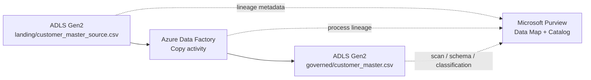

# Architecture

## Objective

Demonstrate a compact but realistic governance flow in Azure where a source file is processed by Azure Data Factory, written to a governed ADLS Gen2 location, discovered by Microsoft Purview, enriched with business metadata, and traced through automated lineage.

## Logical architecture



## Azure resources

| Resource | Role |
|---|---|
| ADLS Gen2 storage account | Landing and governed data estate |
| Microsoft Purview | Discovery, catalog, classification, glossary, stewardship, lineage |
| Azure Data Factory | Source-to-governed copy process and lineage producer |
| Managed Identities | Passwordless service-to-service authentication |
| Azure RBAC | Least-privilege data access |

## Data estate

```text
stdatagovernancedan02
├── landing
│   └── customer_master_source.csv
└── governed
    └── customer_master.csv
```

## Processing path

```text
customer_master_source.csv
        ↓
pl_customer_master_lineage
        ↓
Copy_CustomerMaster_To_Governed
        ↓
customer_master.csv
```

## Access model

Purview:

```text
Managed Identity
└── Storage Blob Data Reader
    └── storage-account scope
```

ADF:

```text
Managed Identity
└── Storage Blob Data Contributor
    └── storage-account scope
```

Authorization scope and scan scope are intentionally independent.

Purview is authorized to read at storage-account scope, while the scan is deliberately scoped to the governed container.

## Design principle

The architecture is intentionally small.

The project is designed to prove governance mechanics and judgment without pretending to be an enterprise governance rollout.
